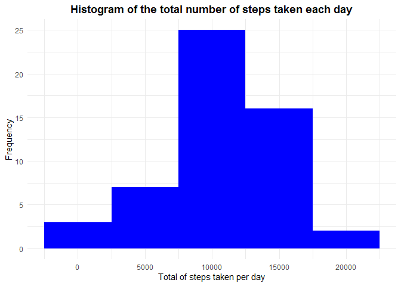
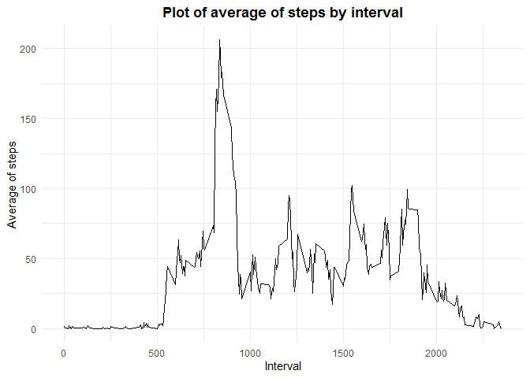
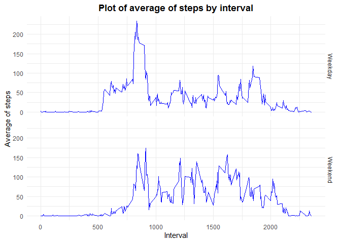

## Loading and preprocessing the data

First, we load our library and preprocess the data.


```r
library(dplyr)
```

```
## 
## Attaching package: 'dplyr'
```

```
## The following objects are masked from 'package:stats':
## 
##     filter, lag
```

```
## The following objects are masked from 'package:base':
## 
##     intersect, setdiff, setequal, union
```

```r
library(ggplot2)

if (!file.exists("activity.csv")) {
    unzip("activity.zip")
}
activity <- read.csv("activity.csv")
```

## 1. What is mean total number of steps taken per day?

Following the steps in the assignment. First, we calculate the total of steps taken per day.
Then, we graph an histogram for this data. Finally, we calculate and report the mean and the median.

### 1.1 Total of steps

We group the data by date using dplyr, and then we summarise it.


```r
activity1 <- activity %>%
    group_by(date) %>%
    summarise(totalSteps = sum(steps))
```

```
## `summarise()` ungrouping output (override with `.groups` argument)
```

### 1.2 Histogram

We plot the histogram using ggplot.


```r
histogram1 <- ggplot(data=activity1, aes(x=totalSteps)) +
    geom_histogram(fill="blue", binwidth = 5000) +
    ggtitle("Histogram of the total number of steps taken each day") +
    xlab("Total of steps taken per day") +
    ylab("Frequency") +
    theme_minimal() +
    theme(plot.title = element_text(hjust=0.5, face="bold"))
histogram1
```

```
## Warning: Removed 8 rows containing non-finite values (stat_bin).
```

<!-- -->

### 1.3 Mean and median

Finally, we know that the mean of this data is 10766 and the median is 10765.


```r
mean(activity1$totalSteps, na.rm=TRUE)
```

```
## [1] 10766.19
```

```r
median(activity1$totalSteps, na.rm=TRUE)
```

```
## [1] 10765
```

## 2. What is the average daily activity pattern?

### 2.1 Time series plot

We graph following the instructios: x-axis for 5-minute interval and y-axis for the average number of steps taken, averaged across all days.


```r
activity2 <- activity %>%
    filter(!is.na(steps)) %>%
    group_by(interval) %>%
    summarise(meanSteps = mean(steps))
```

```
## `summarise()` ungrouping output (override with `.groups` argument)
```

```r
timeseriesplot <- ggplot(data=activity2, 
                         aes(x=interval, 
                            y=meanSteps)) +
    geom_line() +
    ggtitle("Plot of average of steps by interval") +
    xlab("Interval") +
    ylab("Average of steps") +
    theme_minimal() +
    theme(plot.title = element_text(hjust=0.5, face="bold"))
timeseriesplot
```

<!-- -->

### 2.2 Which 5-minute interval, on average across all the days in the dataset, contains the maximum number of steps?

After calculating what is the max in the dataset, we know that the maximun amount of steps occur in the 835 interval.

```r
maxSteps <- max(activity2$meanSteps)
activity2[activity2$meanSteps==maxSteps,]
```

```
## # A tibble: 1 x 2
##   interval meanSteps
##      <int>     <dbl>
## 1      835      206.
```

## 3. Imputing missing values

### 3.1 Total number of rows with NA values
We calculate the number of rows with at least one missing value using the `complete.cases` function of R.


```r
sum(!complete.cases(activity))
```

```
## [1] 2304
```

### 3.2 Strategy for filling missing values
We will fill the NA values using the mean of steps for each interval in that day. For this, we will keep using the dplyr function. First, we are going to calculate the mean for each interval and save it in a new dataframe. Then, we'll merge the two  databases. Finally, we'll assign the mean value for each interval to the NA values in the column "steps".  

### 3.3 New dataset without missing values


```r
activity3 <- activity %>%
    filter(!is.na(steps)) %>%
    group_by(date, interval) %>%
    summarise(meanSteps = mean(steps))
```

```
## `summarise()` regrouping output by 'date' (override with `.groups` argument)
```

### 3.4 New histogram of total number of steps
We calculate the histogram with the new data set. According to the graph, there is no big difference between the new and the first histogram.


```r
activity3 <- activity %>%
    filter(!is.na(steps)) %>%
    group_by(interval) %>%
    summarise(meanSteps = mean(steps))
```

```
## `summarise()` ungrouping output (override with `.groups` argument)
```

```r
nonNAactivity3 <- merge(activity3, activity)
NAactivities <- is.na(nonNAactivity3$steps)
nonNAactivity3$steps[NAactivities] <- nonNAactivity3$meanSteps[NAactivities]

activity3 <-  nonNAactivity3 %>%
    group_by(date) %>%
    summarise(steps = sum(steps))
```

```
## `summarise()` ungrouping output (override with `.groups` argument)
```

We see that the mean and median of this new data set is 10766.


```r
mean(activity3$steps)
```

```
## [1] 10766.19
```

```r
median(activity3$steps)
```

```
## [1] 10766.19
```

## 4. Are there differences in activity patterns between weekdays and weekends?

### 4.1 Creating a new factor


```r
activity4 <- activity
activity4$dayoftheweek <- as.numeric(strftime(as.Date(activity$date, "%Y-%m-%d"), "%u"))
weekend <- activity4$dayoftheweek == 6 | activity4$dayoftheweek == 7
activity4$categoryweek[weekend] <- "Weekend"
activity4$categoryweek[!weekend] <- "Weekday"
```

### 4.2 Making a panel plot
From the panel, we can conclude that there is a slightly differente between the pattern of steps in the invertal rom 750-1000 minutes.


```r
activity4 <- activity4 %>%
    filter(!is.na(steps)) %>%
    group_by(interval, categoryweek) %>%
    summarise(meanSteps = mean(steps))
```

```
## `summarise()` regrouping output by 'interval' (override with `.groups` argument)
```

```r
timeseriesplot2 <- ggplot(data=activity4, 
                         aes(x=interval, 
                             y=meanSteps)) +
    geom_line(col="blue") +
    facet_grid(categoryweek~.) +
    ggtitle("Plot of average of steps by interval") +
    xlab("Interval") +
    ylab("Average of steps") +
    theme_minimal() +
    theme(plot.title = element_text(hjust=0.5, face="bold"))
timeseriesplot2
```

<!-- -->
